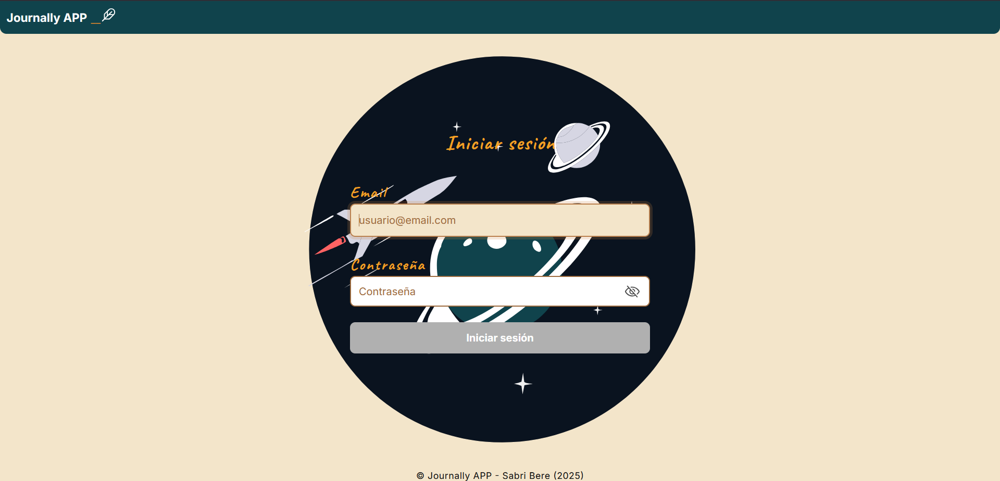
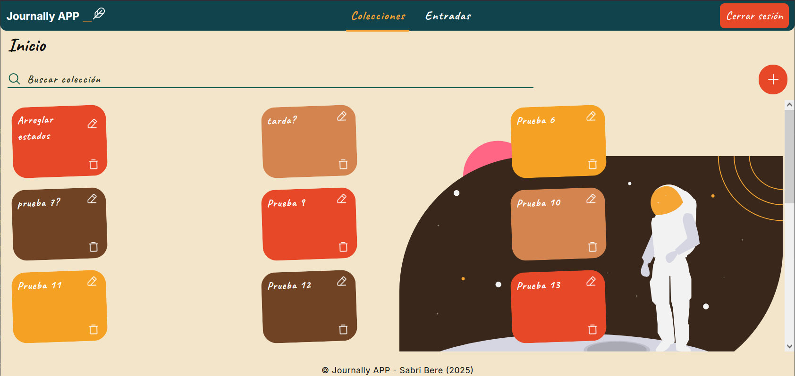
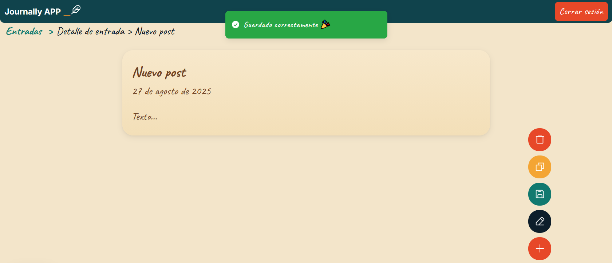
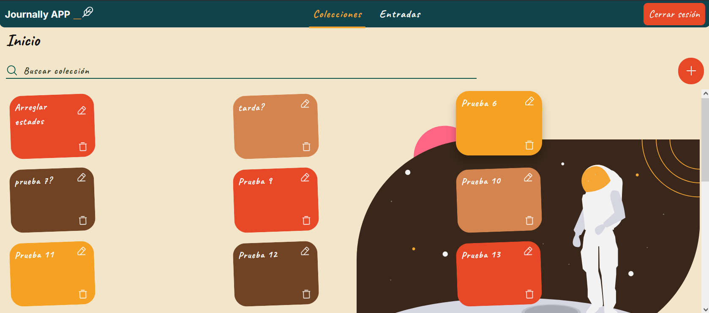
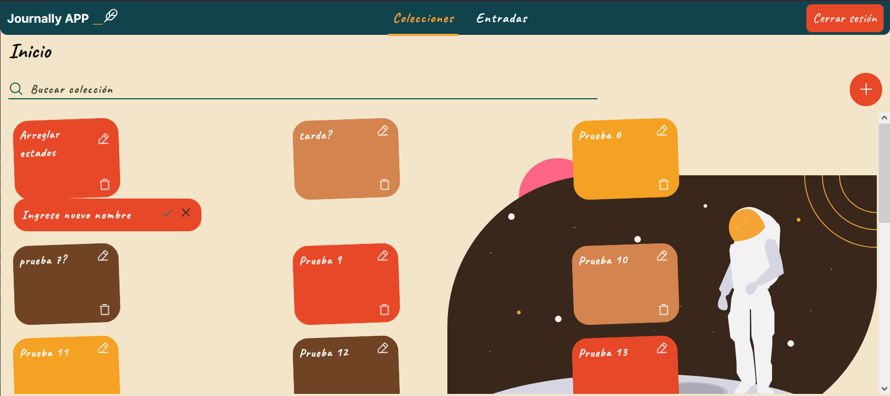
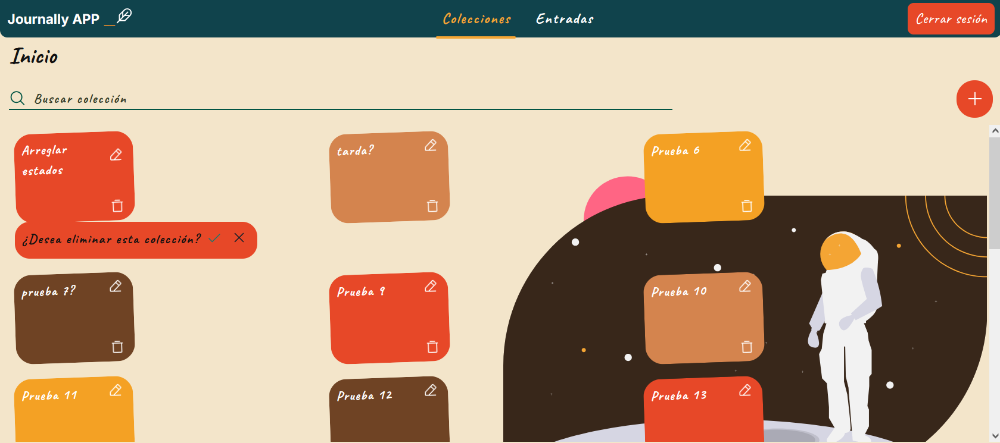
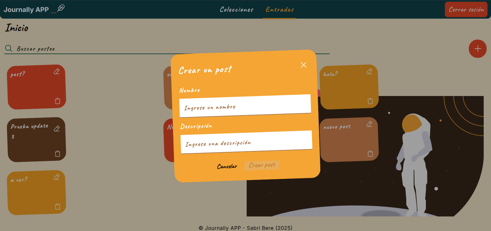

# 🪐 Journally WEB

Web application for managing a **personal digital journal**, with collections and entries designed to support users in their daily writing, organization, and reflection process.

Designed with a soft, illustrated, and minimalist aesthetic intended to feel like a small personal universe.

## Table of contents

- [Introduction](#introduction)
    - [Features](#features)
- [Clone the repository](#clone-the-repository)
- [Installation](#installation)
- [Project stack](#project-stack)
- [Environments and integration](#environments-and-integration)
    - [Environment variables](#environment-variables)
    - [Available scripts](#available-scripts)
- [Deployment](#deployment)
- [Architecture](#architecture)
- [Formatting configuration](#formatting-configuration)
    - [Prettier](#prettier)
    - [ESLint](#eslint)
- [Testing](#testing)
- [Screenshots](#screenshots)

---

## 📝 Introduction

**Journally WEB** is an application focused on personal journaling. Its goal is to provide users with a friendly, simple, and aesthetic tool to record their day-to-day life and organize their thoughts through collections and entries.

### Features

✔️ Create collections

✔️ Create entries within a collection

✔️ Edit collection and entry names

✔️ Delete items

✔️ Clear navigation between sections

✔️ Intuitive UI with tooltips, modals, and visual feedback

### Design

The application uses a style that is:

- Warm and soft

- Handwritten typography

- Custom space-themed illustrations

- Friendly interface focused on user experience

- Rounded components, pastel tones, and vibrant colors for action states

**_(Inspired by a small personal universe ✨)_**

---

## 📦 Clone the repository

```bash
git clone https://github.com/<tu-usuario>/<repo>.git
cd journally-web
```

---

## 🛠 Installation

1. Install dependencies

```bash
npm install
```

2. Create a `.env.dev` file from `.env.example`.

```bash
cp .env.example .env.dev
```

3. Fill in the required variables for your local environment.

4. Run the server

```bash
npm run dev
```

---

## Project stack

- Next.js v.15
- Typescript
- Redux Toolkit
- React Query (TanStack Query)
- Sass / SCSS Modules
- NextAuth
- Axios

---

## 🔧 Environments and integration

### Environment variables

The repository includes `.env.example` as a safe template for documenting the required variables without exposing real credentials.

- `.env.dev` is used for local development.
- `.env.prod` is used for local production builds.
- Files with real values must not be committed to the repository.

Expected variables:

| Variable | Purpose |
| --- | --- |
| `APP_ENV` | Logical application environment, for example `development` or `production`. |
| `NEXT_PUBLIC_APP_URL` | Public frontend URL. |
| `NEXT_PUBLIC_API_URL` | Public URL of the API consumed by the frontend. |
| `NEXTAUTH_URL` | Base URL used by NextAuth. |
| `NEXTAUTH_SECRET` | Secret used by NextAuth. It must be defined with a secure value outside the repository. |
| `NEXT_PUBLIC_APP_VERSION` | Public application version. |

> Variables prefixed with `NEXT_PUBLIC_` may be exposed to the browser. They must not contain secrets.

### Available scripts

```json
"scripts": {
  "dev": "dotenvx run --env-file=.env.dev -- next dev --turbopack",
  "production": "dotenvx run --env-file=.env.prod -- next build",
  "build": "next build",
  "test": "jest",
  "test:watch": "jest --watch",
  "test:coverage": "jest --coverage",
  "test:ci": "jest --runInBand --watchman=false",
  "lint": "eslint \"src/**/*.{js,jsx,ts,tsx}\""
}
```

---

## 🚀 Deployment

The frontend can be deployed to Vercel by connecting the repository to the corresponding project.

- Vercel must read environment variables from the project configuration, not from versioned `.env` files.
- Sensitive values, such as `NEXTAUTH_SECRET`, must be configured directly in the deployment provider.
- The production build uses the standard command:

```bash
next build
```

To keep the repository ready for publication:

- keep only `.env.example` under version control;
- do not publish tokens, secrets, or provider IDs;
- document only the names of the required variables, not their real values.

---

## 🧱 Architecture

```bash
src/
├── app
│   ├── api
│   │   ├── auth
│   │   │   └── [...nextauth]
│   │   └── provider
│   ├── collection
│   │   └── [id]
│   ├── entries
│   │   └── [id]
│   ├── home
│   │   └── components
│   └── login
│       └── components
├── commons
│   ├── Buttons
│   ├── Cards
│   ├── Dropdowns
│   ├── Editor
│   ├── EmptyStates
│   ├── Footer
│   ├── Ilustrations
│   ├── InfinteScroll
│   ├── Inputs
│   ├── Modals
│   ├── Navbar
│   ├── NotFound
│   ├── Sidebar
│   ├── Skeletons
│   ├── Spinner
│   ├── Tabs
│   ├── Title
│   ├── Toast
│   └── Tooltip
├── config
├── hooks
├── services
├── store
├── styles
│   └── icons
└── utils
```

---

## 🧹 Formatting configuration

### Prettier

Suggested `.prettierrc` file:

```json
{
    "singleQuote": true,
    "semi": true,
    "tabWidth": 2,
    "printWidth": 100,
    "trailingComma": "es5"
}
```

---

### ESLint

```json
{
    "extends": [
        "next/core-web-vitals",
        "eslint:recommended",
        "plugin:@typescript-eslint/recommended",
        "prettier"
    ]
}
```

## 🧪 Testing

The project uses Jest for automated testing.

```bash
npm test
npm run test:coverage
```

## 📸 Screenshots

- 🔐 Login page  
  

- 🗂 Collections overview  
  

- ✏️ Collection name editing

- 📝 Entry detail  
  

- 🗃 Modals and tools  
  
  
  
  

---
